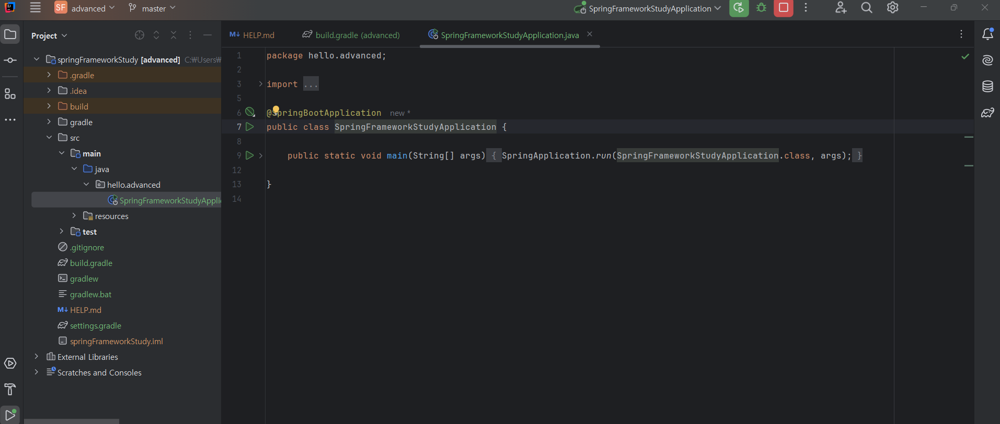

<h1>예제 만들기</h1>


## 1. 예제 프로젝트 만들기


## 2. 로그 추적기 V2 - 프로토타입 개발
애플리케이션의 모든 로직에 직접 로그를 남겨도 되지만, 그것보다 더 효율적인 개발 방법이 필요하다.
특히 트랜잭션 ID 와 깊이를 표현하는 방법은 기존 정보를 이어받아야 하기 때문에 단순히 로그만 남긴다고 해결되는 것은 아니다. 

인텔리제이

요구사항에 맞추어 애플리케이션에 효과적으로 로그를 남기기 위한 로그 추척기를 개발해 보자.
먼저 프로토타입 버전을 개발해 보자.
아마 코드를 모두 작성하고 테스트 코드까지 실행해 보아야 어떤 것을 하는지 감이 올 거싱다.

먼저 로그 추적기를 위한 기반 데이터를 가지고 있는 TraceId, TraceStatus 클래스를 만들어 보자.\ 

```java
package hello.advanced.trace;

import java.util.UUID;

public class TraceId {

    private String id;
    private int level; // 얼마나 깊은 트랜잭션인가 구분

    public TraceId(String id, int level) {
        this.id = createId();
        this.level = 0;
    }

    private String createId() {
        return UUID.randomUUID().toString().substring(0, 8);
    }

    private TraceId createNextId() {
        return new TraceId(id, level + 1);
    }

    private TraceId createPreviousId() {
        return new TraceId(id, level - 1);
    }

    public boolean isFirstLevel() {
        return level == 0;
    }

    public String getId() {
        return id;
    }

    public int getLevel() {
        return level;
    }

}
```

### 'traceId' 클래스
로그 추적기는 트랜잭션 ID 와 깊이를 표현하는 방법이 필요하다.
여기서는 트랜잭션 ID 와 깊이를 표현하는 level 을 묶어서 TraceId 라는 개념을 만들었다.
TraceId 는 단순히 id (트랜잭션 ID) 와 level 정보를 가지고 있다.